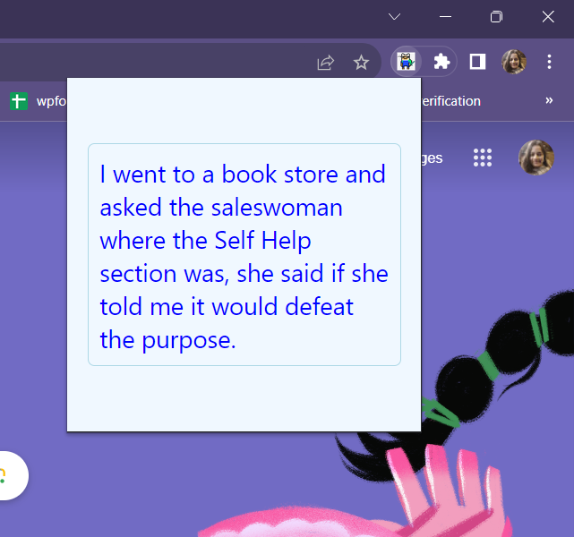
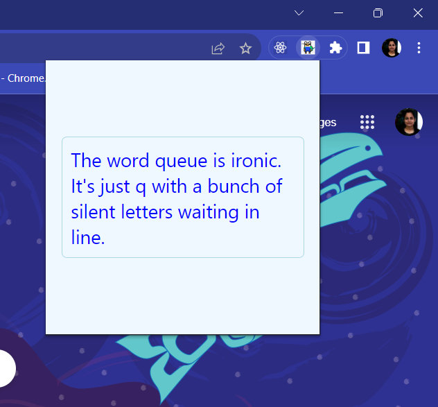

# Dad Jokes
This is a chrome extension that gives you a DAD JOKE every time you roam in chrome, stop at this extension and click!

## Example Previews

  
  

## Getting Started

Here is how you can clone this extension and set it up on your local pc

->Clone this repo using git clone <repo_url>
->open 'manage extensions' in chrome
->switch on the "developer mode" on top right side of window
->go to 'load unpacked'
->select this directory
->switch off 'developer mode'
->pin this extension, that's it. You are now ready to use this extension in your chrome. Happy dadjoking :)